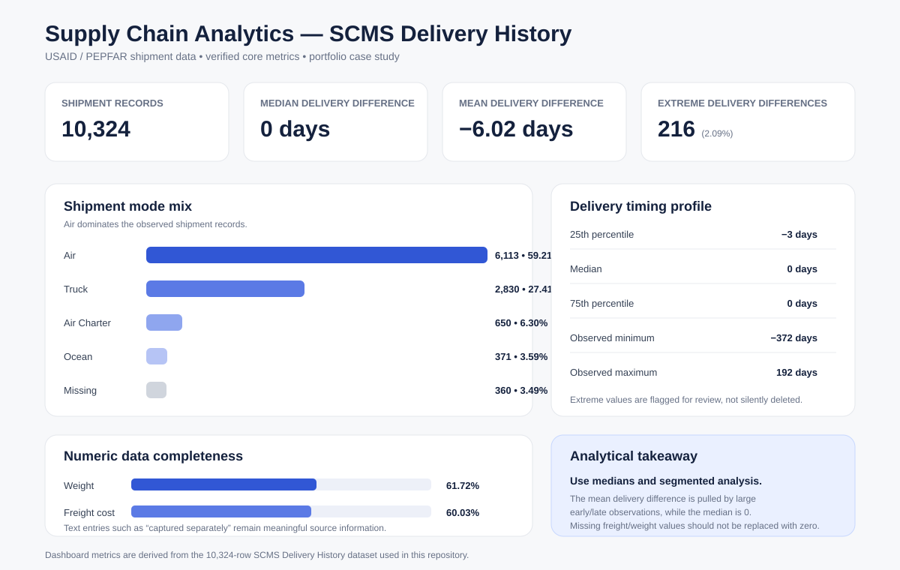

# Supply Chain Analytics

End-to-end supply chain analytics case study using the **USAID / PEPFAR SCMS Delivery History dataset** to examine shipment mix, freight cost, delivery timing, data quality, vendors, countries, and logistics patterns.

This project demonstrates a complete analytics workflow: **data inspection → cleaning → exploratory analysis → statistical testing → SQL analysis → dashboarding → business recommendations**.



## Executive summary

The dataset contains **10,324 shipment records**. The analysis shows that Air is the dominant shipment mode, delivery timing is generally close to schedule at the median, and freight/weight fields require careful treatment because many non-numeric values contain meaningful operational information rather than true zeros.

### Verified highlights

- **10,324** shipment records analyzed
- **Air:** 6,113 shipments (**59.21%**)
- **Truck:** 2,830 shipments (**27.41%**)
- **Air Charter:** 650 shipments (**6.30%**)
- **Ocean:** 371 shipments (**3.59%**)
- **Median delivered-minus-scheduled difference:** **0 days**
- **Mean delivered-minus-scheduled difference:** **-6.02 days**
- **Extreme delivery differences beyond ±100 days:** **216 records (2.09%)**
- Numeric shipment weight available for **6,372 records (61.72%)**
- Numeric freight cost available for **6,198 records (60.03%)**

## Business questions

The project focuses on practical supply-chain questions such as:

- Which shipment modes are used most frequently?
- How do freight costs differ by shipment mode?
- Which countries and vendors account for the most shipments?
- How closely do scheduled and actual delivery dates align?
- Which shipment modes have higher late-delivery rates?
- What relationship exists between shipment weight and freight cost?
- How should missing or non-numeric operational fields be handled without creating false information?

## Analytical approach

### 1. Data quality and cleaning

The raw dataset is inspected for schema, missing values, cardinality, date formats, and non-numeric freight/weight entries.

The cleaning process:

- converts delivery dates to usable datetime fields
- creates numeric `Weight_kg` and `Freight_Cost_USD` fields where possible
- preserves original source text instead of incorrectly replacing non-numeric values with zero
- calculates `Delivery_Delay_Days`
- flags unusually large delivery differences for separate review

### 2. Exploratory data analysis

Python analysis covers:

- shipment-mode distribution
- top destination countries
- top vendors
- freight-cost summaries by shipment mode
- delivery timing and late-rate patterns
- freight-per-kilogram where both numeric values are available
- extreme delivery records

### 3. Statistical analysis

The project includes:

- **Spearman correlation** between shipment weight and freight cost
- **Kruskal-Wallis test** for freight-cost differences across shipment modes
- **Chi-square test** for association between shipment mode and delivery status

These methods were selected because operational shipment data is not assumed to be normally distributed.

### 4. SQL / PostgreSQL

The SQL layer includes a relational schema and business queries for:

- shipment counts and shares by mode
- country and vendor rankings
- freight-cost summaries
- delivery-performance comparisons
- late-rate analysis
- freight-per-kilogram calculations

### 5. Dashboard and recommendations

The recruiter-facing dashboard summarizes the verified headline metrics, while the findings document translates the analysis into business recommendations.

## Key findings

1. **Air dominates the shipment mix.** Air represents 59.21% of all records, so aggregate results are heavily influenced by air shipments.
2. **Median delivery timing is more informative than the mean.** The median delivery difference is 0 days, while the mean is -6.02 days because the distribution contains large early/late observations.
3. **Extreme delivery differences should be investigated, not automatically deleted.** 216 records fall outside ±100 days.
4. **Missingness carries operational meaning.** Freight and weight fields include text such as values being captured separately or invoiced differently; treating these entries as zero would distort analysis.
5. **Cost comparisons should be segmented.** Shipment mode and weight should be considered when comparing freight cost.

See [`docs/business_findings.md`](docs/business_findings.md) for the full interpretation and recommendations.

## Tools and skills demonstrated

- Python
- pandas
- NumPy
- Matplotlib
- SciPy
- SQL
- PostgreSQL
- SQLAlchemy
- exploratory data analysis
- statistical testing
- data cleaning
- KPI development
- dashboard design
- business analysis
- Git / GitHub

## Repository structure

```text
supply-chain-analytics/
├── data/                    # Dataset notes; raw/cleaned CSVs are gitignored
├── dashboards/
│   └── supply_chain_dashboard.svg
├── docs/
│   ├── business_findings.md
│   ├── dataset-selection.md
│   └── project_plan.md
├── notebooks/
│   ├── 01_data_inspection.py
│   ├── 02_data_cleaning.py
│   ├── 03_exploratory_analysis.py
│   └── 04_statistical_analysis.py
├── sql/
│   ├── schema.sql
│   └── analysis_queries.sql
├── src/
│   ├── download_data.py
│   └── load_postgres.py
├── requirements.txt
├── run_pipeline.py
└── README.md
```

## Reproduce the analysis

Install the required packages:

```bash
pip install -r requirements.txt
```

Run the full Python pipeline:

```bash
python run_pipeline.py
```

The pipeline downloads the public dataset, inspects it, cleans it, runs exploratory analysis, and performs the statistical analysis.

To load the cleaned data into PostgreSQL:

```bash
python src/load_postgres.py
```

Then run the queries in:

```text
sql/analysis_queries.sql
```

## Project status

- [x] Dataset selection and documentation
- [x] Data inspection
- [x] Data cleaning
- [x] Python exploratory analysis
- [x] Statistical analysis
- [x] PostgreSQL schema and SQL business queries
- [x] Dashboard
- [x] Business findings and recommendations
- [x] Reproducible pipeline

**Status: complete portfolio case study.**

## Data note

The source dataset contains operational records and should not be interpreted as a complete view of all PEPFAR purchases or total landed cost. Some orders may be represented across multiple shipment records, and observational relationships should not be interpreted as causal effects.
